# ACP² Proxy Server

**ACP²** (pronounced "ACP Squared") is a protocol bridge that solves the **ZedACP ↔ IBM ACP confusion** by seamlessly connecting agents built for the **Agent Client Protocol** (Zed's stdio/JSON-RPC protocol) with clients expecting the **Agent Communication Protocol** (IBM's RESTful HTTP API).

## The ZedACP / IBM ACP Confusion

There are **two different "ACP" protocols** in the AI agent ecosystem, both with similar goals but incompatible implementations:

### ZedACP (Agent Client Protocol)
- **Creator**: Zed Industries (zed.dev)
- **Transport**: JSON-RPC over stdio (stdin/stdout)
- **Use Case**: Designed for IDE/editor integration
- **Agents**: `codex-acp`, `claude-code-acp`, `gemini-cli`, etc.
- **Protocol**: JSON-RPC with methods like `initialize`, `session/new`, `session/prompt`
- **Features**: Real-time streaming, tool calls, file system access, terminal integration

### IBM ACP (Agent Communication Protocol)
- **Creator**: IBM (agentcommunicationprotocol.dev)
- **Transport**: RESTful HTTP API
- **Use Case**: Cloud-native agent orchestration
- **Servers**: HTTP servers hosting multiple agents
- **Protocol**: REST endpoints like `/runs`, `/agents`, `/runs/{id}/cancel`
- **Features**: Agent discovery, run management, standardized message formats

## ACP²: The Bridge Solution

ACP² eliminates this confusion by providing a **transparent proxy** that:

1. **Accepts IBM ACP HTTP requests** (`POST /runs`, `GET /agents`, etc.)
2. **Translates them to ZedACP JSON-RPC** (`session/prompt`, `initialize`, etc.)
3. **Launches and manages ZedACP agents** as subprocesses
4. **Translates responses back to IBM ACP format**
5. **Maintains protocol compliance** for both sides

```mermaid
graph LR
    A[IBM ACP Client] -->|HTTP/REST| B[ACP² Proxy]
    B -->|JSON-RPC/stdio| C[ZedACP Agent]
    B -->|HTTP/REST| D[IBM ACP Client]
    C -->|JSON-RPC/stdio| B
```



## Architecture

ACP² follows the **"Agent Wrapper"** pattern described in the ACP specification:

```
┌─────────────────┐    ┌──────────────────┐    ┌─────────────────┐
│   IBM ACP       │    │   ACP² Proxy     │    │   ZedACP Agent  │
│   Client        │◄──►│   (This Project) │◄──►│   (codex-acp)   │
│                 │    │                  │    │                 │
│ • HTTP/REST     │    │ • Protocol Bridge│    │ • JSON-RPC/stdio│
│ • /runs         │    │ • Subprocess Mgr │    │ • initialize    │
│ • /agents       │    │ • Message Trans. │    │ • session/new   │
└─────────────────┘    └──────────────────┘    └─────────────────┘
```

## Key Features

### 🔄 **Protocol Translation**
- ZedACP `session/prompt` ↔ IBM ACP `POST /runs`
- ZedACP `session/update` ↔ IBM ACP Server-Sent Events
- ZedACP `session/cancel` ↔ IBM ACP `POST /runs/{id}/cancel`

### 🚀 **Agent Management**
- Launch ZedACP agents as subprocesses
- Environment variable injection (API keys, etc.)
- Graceful process lifecycle management
- Concurrent session support

### 📡 **Real-time Streaming**
- **Sync Mode**: Buffered responses for traditional clients
- **Stream Mode**: Server-Sent Events for real-time updates
- **Message Chunks**: Proper aggregation of `agent_message_chunk` events

### 🔐 **Authentication**
- Bearer token authentication for IBM ACP clients
- API key injection for ZedACP agents
- Secure credential handling

### 🎯 **ZedACP Agent Compatibility**
- ✅ `codex-acp` (OpenAI)
- ✅ `claude-code-acp` (Anthropic)
- ✅ `gemini-cli` (Google)
- ✅ Any ZedACP-compliant agent

## Quick Start

### Prerequisites
- Python 3.9+
- `uv` package manager
- ZedACP agent (e.g., `codex-acp`)

### Installation

```bash
# Clone the repository
git clone https://github.com/mrorigo/acp-squared.git
cd acp2

# Install dependencies
make dev-install

# Configure your ZedACP agent
cp config/agents.json.example config/agents.json
# Edit config/agents.json with your agent details
```

### Configuration

```json
{
  "agents": [
    {
      "name": "codex-acp",
      "description": "OpenAI Codex agent",
      "command": ["/path/to/codex-acp"],
      "api_key": "${OPENAI_API_KEY}"
    }
  ]
}
```

### Run the Server

```bash
# Set authentication token
export ACP2_AUTH_TOKEN="your-secret-token"

# Start the proxy server
make run

# Server will be available at http://localhost:8001
```

### Test the Integration

```bash
# Ping the server
curl -H "Authorization: Bearer your-secret-token" \
     http://localhost:8001/ping

# List available agents
curl -H "Authorization: Bearer your-secret-token" \
     http://localhost:8001/agents

# Create a run
curl -X POST http://localhost:8001/runs \
  -H "Authorization: Bearer your-secret-token" \
  -H "Content-Type: application/json" \
  -d '{
    "agent": "codex-acp",
    "mode": "sync",
    "input": {
      "role": "user",
      "content": [{"type": "text", "text": "Hello, world!"}]
    }
  }'
```

## API Reference

ACP² implements the full **IBM ACP specification**:

### Core Endpoints

| Method | Endpoint | Description |
|--------|----------|-------------|
| `GET` | `/ping` | Health check |
| `GET` | `/agents` | List available agents |
| `GET` | `/agents/{name}` | Get agent manifest |
| `POST` | `/runs` | Create new run (sync/stream) |
| `GET` | `/runs/{id}` | Get run status |
| `POST` | `/runs/{id}/cancel` | Cancel running run |

### Run Modes

- **`sync`**: Traditional request/response
- **`stream`**: Server-Sent Events for real-time updates
- **`async`**: Fire-and-forget with webhooks (future)

### Message Format

ACP² translates between ZedACP content blocks and IBM ACP message parts:

```typescript
// IBM ACP Input
{
  "role": "user",
  "content": [
    {"type": "text", "text": "Hello"},
    {"type": "image", "data": "...", "mimeType": "image/png"}
  ]
}

// ZedACP Translation
{
  "sessionId": "sess_123",
  "prompt": [
    {"type": "text", "text": "Hello"},
    {"type": "image", "data": "...", "mimeType": "image/png"}
  ]
}
```

## ZedACP Protocol Compliance

ACP² implements the complete ZedACP lifecycle:

### 1. **Initialization**
```json
// Client → Agent
{
  "jsonrpc": "2.0",
  "id": 0,
  "method": "initialize",
  "params": {
    "protocolVersion": 1,
    "clientCapabilities": {
      "fs": {"readTextFile": true, "writeTextFile": true},
      "terminal": true
    }
  }
}
```

### 2. **Authentication** (if required)
```json
{
  "jsonrpc": "2.0",
  "id": 1,
  "method": "authenticate",
  "params": {"methodId": "apikey"}
}
```

### 3. **Session Management**
```json
{
  "jsonrpc": "2.0",
  "id": 2,
  "method": "session/new",
  "params": {
    "cwd": "/project",
    "mcpServers": [...]
  }
}
```

### 4. **Prompt Processing**
```json
{
  "jsonrpc": "2.0",
  "id": 3,
  "method": "session/prompt",
  "params": {
    "sessionId": "sess_123",
    "prompt": [...]
  }
}
```

### 5. **Real-time Updates**
```json
{
  "jsonrpc": "2.0",
  "method": "session/update",
  "params": {
    "sessionId": "sess_123",
    "update": {
      "sessionUpdate": "agent_message_chunk",
      "content": {"type": "text", "text": "Thinking..."}
    }
  }
}
```

## Deployment

### Docker (Recommended)

```dockerfile
FROM python:3.11-slim

WORKDIR /app
COPY . /app

RUN pip install uv
RUN make dev-install

EXPOSE 8001
ENV ACP2_AUTH_TOKEN="your-secret-token"

CMD ["uvicorn", "src.acp2_proxy.main:create_app", "--host", "0.0.0.0", "--port", "8001"]
```

### Production Considerations

- **Reverse Proxy**: Use nginx/traefik for TLS termination
- **Authentication**: Rotate tokens regularly
- **Monitoring**: Add structured logging and metrics
- **Scaling**: Deploy multiple instances behind load balancer
- **Security**: Run in isolated environment with minimal privileges

## Development

### Project Structure

```
acp2/
├── src/acp2_proxy/          # Main application code
│   ├── main.py             # FastAPI application
│   ├── zed_agent.py        # ZedACP subprocess management
│   ├── run_manager.py      # Run lifecycle management
│   ├── agent_registry.py   # Agent configuration
│   └── models.py           # Pydantic models
├── tests/                  # Test suite
│   ├── test_agents.py      # Agent endpoint tests
│   ├── test_runs.py        # Run lifecycle tests
│   └── dummy_agent.py      # Test ZedACP agent
├── config/                 # Configuration
│   └── agents.json         # Agent definitions
└── docs/                   # Documentation
    ├── research.md         # Protocol research
    └── ZedACP.md           # ZedACP specification
```

### Running Tests

```bash
# Run all tests
make test

# Run with coverage
make test-coverage

# Run specific test
python -m pytest tests/test_runs.py::test_run_sync -v
```

### Adding New ZedACP Agents

1. **Install the agent** (e.g., `codex-acp`, `claude-code-acp`)
2. **Add to config/agents.json**:
   ```json
   {
     "name": "new-agent",
     "description": "Description of the agent",
     "command": ["/path/to/agent", "--stdio"],
     "api_key": "${API_KEY_ENV_VAR}"
   }
   ```
3. **Set environment variables** for API keys
4. **Restart the server** and test

## Why ACP²?

### For ZedACP Agent Developers
- **Instant HTTP API**: No need to implement HTTP servers
- **Cloud Compatibility**: Deploy agents in cloud environments
- **Multi-client Support**: Serve multiple HTTP clients simultaneously
- **Standard Interface**: Consistent API across all agents

### For IBM ACP Client Developers
- **Agent Ecosystem**: Access to all ZedACP agents
- **Transparent Proxy**: No protocol knowledge required
- **Drop-in Replacement**: Works with existing IBM ACP clients
- **Performance**: Efficient subprocess management

### For Platform Builders
- **Agent Marketplace**: Host multiple agents behind single endpoint
- **Unified Interface**: Consistent API for diverse agents
- **Easy Integration**: Simple configuration-based setup
- **Production Ready**: Robust error handling and logging

## Troubleshooting

### Common Issues

**"Agent not found"**
- Check `config/agents.json` configuration
- Verify agent binary path and permissions
- Ensure agent is installed and accessible

**"Authentication failed"**
- Verify `ACP2_AUTH_TOKEN` environment variable
- Check agent API key configuration
- Review ZedACP agent authentication requirements

**"Protocol parsing errors"**
- Check ZedACP agent output format
- Verify JSON-RPC message structure
- Review subprocess stdout/stderr logs

**"Streaming not working"**
- Ensure client supports Server-Sent Events
- Check for proxy/firewall interference
- Verify ZedACP agent supports streaming

### Debug Mode

Enable verbose logging:

```bash
export ACP2_LOG_LEVEL=DEBUG
export ACP2_AUTH_TOKEN="your-token"
python -m uvicorn src.acp2_proxy.main:create_app --reload
```

## Contributing

We welcome contributions! Please see [CONTRIBUTING.md](CONTRIBUTING.md) for guidelines.

### Development Philosophy
- **KISS (Keep It Simple)**: Avoid over-engineering
- **Protocol Compliance**: Maintain strict ZedACP and IBM ACP compatibility
- **Comprehensive Testing**: Test all protocol edge cases
- **Production Ready**: Robust error handling and logging

## License

This project is licensed under the Apache License 2.0 - see the [LICENSE](LICENSE) file for details.

## Acknowledgments

- **Zed Industries** for the Agent Client Protocol specification
- **IBM** for the Agent Communication Protocol specification
- **ACP Community** for advancing agent interoperability

---

**ACP²** - Because sometimes you need two ACP protocols to make the ecosystem work! 🤖➕🤖